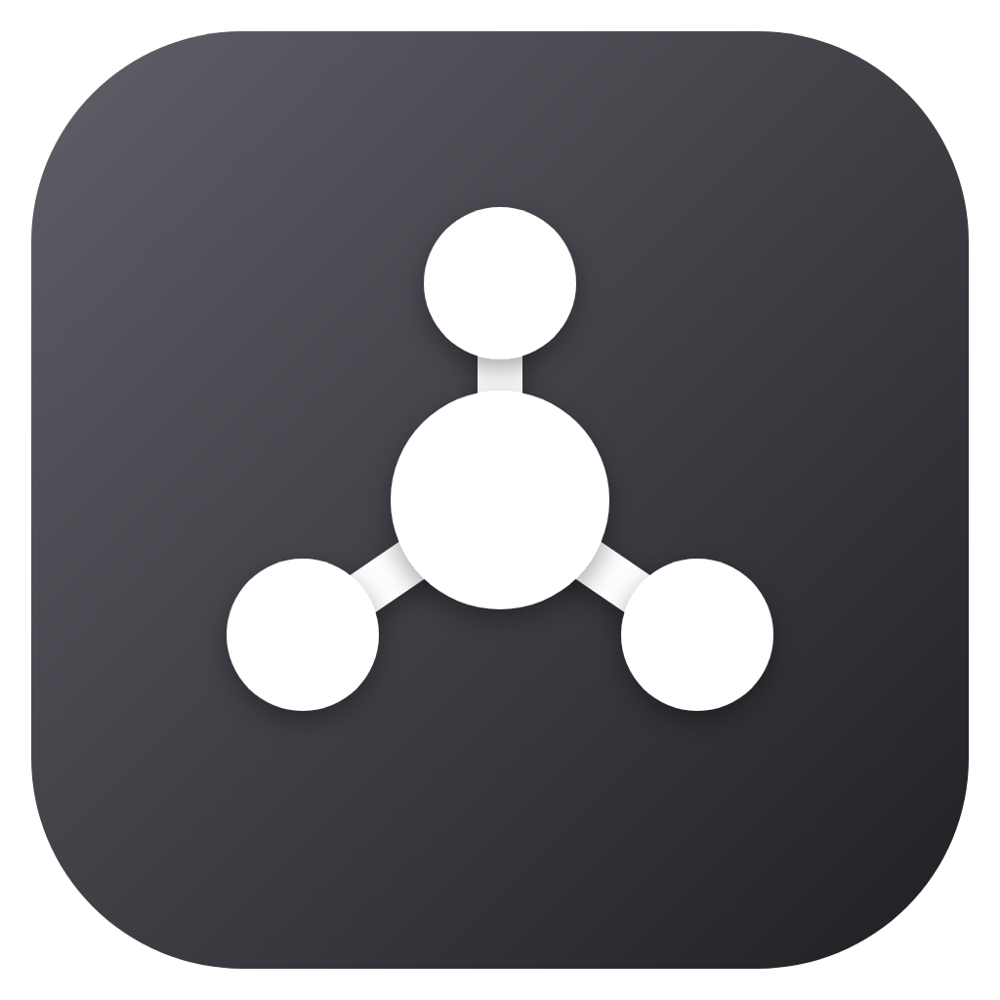

  

<h1 align="center">NetLab</h1>

  A desktop app for building and experimenting with network topologies using real Docker containers.

## What is NetLab

NetLab lets students design a network topology visually — nodes, cables, switches — and have each element backed by a real, runnable environment: every node is a Docker container, every cable/link is a real Docker network. Students configure IP addresses, routes, bridges and firewall rules by hand, inside the actual container's shell, exactly as they would on real hardware — NetLab only handles the wiring, not the networking itself.

## Features

- **Visual topology editor** — drag nodes onto a canvas, connect them with links, pan/zoom, resize the layout.
- **Real containers, real shells** — every node opens in your OS's native terminal (not an emulator embedded in the app), attached via `docker exec`.
- **Multiple base images** — Alpine, Debian, and Ubuntu, each pre-loaded with a full network toolset (`iproute2`, `iptables`, `bridge-utils`, `tcpdump`, `ethtool`, and more).
- **Switch nodes** — a node can bridge two links together (`ip link add br0 type bridge`), taught and built by the student; NetLab transparently works around a Docker Desktop quirk (hairpin mode) that would otherwise break it.
- **Internet-facing nodes** — a dedicated WAN bridge with NAT, for exercises that need outbound connectivity while the student still configures `ip_forward`/`iptables MASQUERADE` themselves.
- **Self-healing** — Docker resources NetLab owns (networks, custom images, orphaned containers) are detected and rebuilt automatically if something external interferes with them (e.g. `docker network rm` run by hand).
- **Bilingual UI** — Italian and English, switchable at runtime.

## Requirements

- **Docker** (Docker Desktop on Windows/macOS, or Docker Engine on Linux), installed and running.

## Installation

Download the installer for your platform from the [Releases page](../../releases):

- **Windows** — `NetLab Setup x.y.z.exe`
- **macOS** — `NetLab-x.y.z.dmg`
- **Linux** — `NetLab-x.y.z.AppImage` (self-contained, no installation needed — just make it executable and run it)

Make sure Docker is running before you launch NetLab.

## Getting started

See the [user guide](docs/user-guide.md) for a step-by-step walkthrough of building your first topology.

## Development

See the [developer guide](docs/developer-guide.md) for the project's architecture, how to run it locally, and how to build a release.
